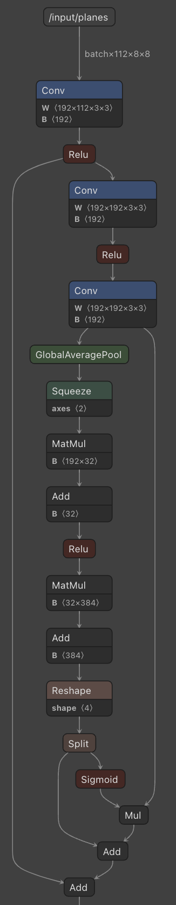
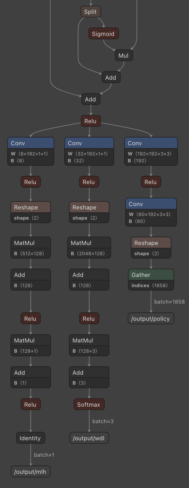

<html lang="en">
<head>
<meta charset="UTF-8">
<meta name="viewport" content="width=device-width, initial-scale=1.0">
<title>Webp Image Viewer</title>
<!-- <link rel="stylesheet" href="lc0/style.css"> -->
<!-- <link rel="stylesheet" href="{{ 'lc0/style.css' | relative_url }}"> -->
<link rel="stylesheet" href="{{ '/assets/lc0/style.css' | relative_url }}">

<link href="https://cdnjs.cloudflare.com/ajax/libs/prism/1.23.0/themes/prism.min.css" rel="stylesheet" />

</head>
<body>
    
Acquisition of Chess Knowledge in Leela Chess Zero (Lc0)

    
by Alex Wilson

    
The following is work to reproduce parts of the <a href="https://arxiv.org/abs/2111.09259">Acquisition of Chess Knowledge in AlphaZero paper</a> with open source models and code. The following visualization describes concepts from Leela Chess Zero's ‘representational space’ (i.e., internal activations) and mirrors the original paper's <a href="https://storage.googleapis.com/uncertainty-over-space/alphachess/index.html?block=0&factor=0">Online Supplement</a>. 36 factors are extracted from the activations of each of the network's 15 ResNet blocks using a non-negative matrix factorization-based approach.

    
You can use the left and right arrow keys to change Factors quickly

    
You can use the left and right arrow keys with shift to change Blocks quickly

    

      <!-- Block Selector -->
      

        
Block

        <input type="radio" id="block1" name="block" value="1" class="grid-item" checked>
        <label for="block1" class="grid-label">1</label>
        <input type="radio" id="block2" name="block" value="2" class="grid-item">
        <label for="block2" class="grid-label">2</label>
        <input type="radio" id="block3" name="block" value="3" class="grid-item">
        <label for="block3" class="grid-label">3</label>
        <input type="radio" id="block4" name="block" value="4" class="grid-item">
        <label for="block4" class="grid-label">4</label>
        <input type="radio" id="block5" name="block" value="5" class="grid-item">
        <label for="block5" class="grid-label">5</label>
        <input type="radio" id="block6" name="block" value="6" class="grid-item">
        <label for="block6" class="grid-label">6</label>
        <input type="radio" id="block7" name="block" value="7" class="grid-item">
        <label for="block7" class="grid-label">7</label>
        <input type="radio" id="block8" name="block" value="8" class="grid-item">
        <label for="block8" class="grid-label">8</label>
        <input type="radio" id="block9" name="block" value="9" class="grid-item">
        <label for="block9" class="grid-label">9</label>
        <input type="radio" id="block10" name="block" value="10" class="grid-item">
        <label for="block10" class="grid-label">10</label>
        <input type="radio" id="block11" name="block" value="11" class="grid-item">
        <label for="block11" class="grid-label">11</label>
        <input type="radio" id="block12" name="block" value="12" class="grid-item">
        <label for="block12" class="grid-label">12</label>
        <input type="radio" id="block13" name="block" value="13" class="grid-item">
        <label for="block13" class="grid-label">13</label>
        <input type="radio" id="block14" name="block" value="14" class="grid-item">
        <label for="block14" class="grid-label">14</label>
        <input type="radio" id="block15" name="block" value="15" class="grid-item">
        <label for="block15" class="grid-label">15</label>
      

        <!-- Factor Selector -->
        

          
Factor

          <input type="radio" id="factor1" name="factor" value="1" class="grid-item" checked>
          <label for="factor1" class="grid-label">1</label>
          <input type="radio" id="factor2" name="factor" value="2" class="grid-item">
          <label for="factor2" class="grid-label">2</label>
          <input type="radio" id="factor3" name="factor" value="3" class="grid-item">
          <label for="factor3" class="grid-label">3</label>
          <input type="radio" id="factor4" name="factor" value="4" class="grid-item">
          <label for="factor4" class="grid-label">4</label>
          <input type="radio" id="factor5" name="factor" value="5" class="grid-item">
          <label for="factor5" class="grid-label">5</label>
          <input type="radio" id="factor6" name="factor" value="6" class="grid-item">
          <label for="factor6" class="grid-label">6</label>
          <input type="radio" id="factor7" name="factor" value="7" class="grid-item">
          <label for="factor7" class="grid-label">7</label>
          <input type="radio" id="factor8" name="factor" value="8" class="grid-item">
          <label for="factor8" class="grid-label">8</label>
          <input type="radio" id="factor9" name="factor" value="9" class="grid-item">
          <label for="factor9" class="grid-label">9</label>
          <input type="radio" id="factor10" name="factor" value="10" class="grid-item">
          <label for="factor10" class="grid-label">10</label>
          <input type="radio" id="factor11" name="factor" value="11" class="grid-item">
          <label for="factor11" class="grid-label">11</label>
          <input type="radio" id="factor12" name="factor" value="12" class="grid-item">
          <label for="factor12" class="grid-label">12</label>
          <input type="radio" id="factor13" name="factor" value="13" class="grid-item">
          <label for="factor13" class="grid-label">13</label>
          <input type="radio" id="factor14" name="factor" value="14" class="grid-item">
          <label for="factor14" class="grid-label">14</label>
          <input type="radio" id="factor15" name="factor" value="15" class="grid-item">
          <label for="factor15" class="grid-label">15</label>
          <input type="radio" id="factor16" name="factor" value="16" class="grid-item">
          <label for="factor16" class="grid-label">16</label>
          <input type="radio" id="factor17" name="factor" value="17" class="grid-item">
          <label for="factor17" class="grid-label">17</label>
          <input type="radio" id="factor18" name="factor" value="18" class="grid-item">
          <label for="factor18" class="grid-label">18</label>
          <input type="radio" id="factor19" name="factor" value="19" class="grid-item">
          <label for="factor19" class="grid-label">19</label>
          <input type="radio" id="factor20" name="factor" value="20" class="grid-item">
          <label for="factor20" class="grid-label">20</label>
          <input type="radio" id="factor21" name="factor" value="21" class="grid-item">
          <label for="factor21" class="grid-label">21</label>
          <input type="radio" id="factor22" name="factor" value="22" class="grid-item">
          <label for="factor22" class="grid-label">22</label>
          <input type="radio" id="factor23" name="factor" value="23" class="grid-item">
          <label for="factor23" class="grid-label">23</label>
          <input type="radio" id="factor24" name="factor" value="24" class="grid-item">
          <label for="factor24" class="grid-label">24</label>
          <input type="radio" id="factor25" name="factor" value="25" class="grid-item">
          <label for="factor25" class="grid-label">25</label>
          <input type="radio" id="factor26" name="factor" value="26" class="grid-item">
          <label for="factor26" class="grid-label">26</label>
          <input type="radio" id="factor27" name="factor" value="27" class="grid-item">
          <label for="factor27" class="grid-label">27</label>
          <input type="radio" id="factor28" name="factor" value="28" class="grid-item">
          <label for="factor28" class="grid-label">28</label>
          <input type="radio" id="factor29" name="factor" value="29" class="grid-item">
          <label for="factor29" class="grid-label">29</label>
          <input type="radio" id="factor30" name="factor" value="30" class="grid-item">
          <label for="factor30" class="grid-label">30</label>
          <input type="radio" id="factor31" name="factor" value="31" class="grid-item">
          <label for="factor31" class="grid-label">31</label>
          <input type="radio" id="factor32" name="factor" value="32" class="grid-item">
          <label for="factor32" class="grid-label">32</label>
          <input type="radio" id="factor33" name="factor" value="33" class="grid-item">
          <label for="factor33" class="grid-label">33</label>
          <input type="radio" id="factor34" name="factor" value="34" class="grid-item">
          <label for="factor34" class="grid-label">34</label>
          <input type="radio" id="factor35" name="factor" value="35" class="grid-item">
          <label for="factor35" class="grid-label">35</label>
          <input type="radio" id="factor36" name="factor" value="36" class="grid-item">
          <label for="factor36" class="grid-label">36</label>
        

      

<!--  -->

Motivation

    
Deep learning AI models are built of billions of small math operations—far too many to inspect individually. So while we can inspect any single operation, or neuron, building an understanding of how the "black boxes" of the entire AI model works has been difficult.

    
We want to understand the 'circuits' within neural networks—structures that operate at a higher level than the individual math operations and a lower level than the network’s overall behavior. These circuits function like small decision-making paths within the network, helping to break down complex tasks. Primary motivations include:

    <ul>
        <li>Making guarantees about the network's behavior</li>
        <li>Proving whether it has learned specific concepts</li>
        <li>Observing when and how circuits develop</li>
        <li>Engineering improvements to make training and inference more efficient</li>
    </ul>

    
Investigating whether super-human chess-playing neural networks contain human-understandable concepts could help in understanding high-performing AI models, as these models might reveal patterns useful beyond their intended tasks.

Technical Details

Code: https://github.com/awlego/lc0-knowledge

https://en.wikipedia.org/wiki/File:NMF.png

7.1 Non-negative matrix factorisation
Non-negative matrix factorisation (NMF) [14] is an approach to discover features in an unsupervised way. It has previously
been used to interpret vision [15] and simple RL models [91]. In this section we explore NMF as a complementary unsupervised
approach to the probes trained in Section 4: rather than probe activations for specific concepts, we instead simplify the
activations in a concept-agnostic way. This allows the structure of the activations to reveal itself, instead of imposing our
assumptions on it.

Each layer has activations we know to be non-negative. 

The DeepMind paper uses AlphaZero, which has 20 blocks with input size of 8×8×119-dimensional tensor, which passes through 3x3 convolutional layer to 256 channels (W=8, H=8, C=256).

Of note: In the input z0, a history length of h = 8 plies is used, encoding the current board position and those of the seven preceding plies.

The Leela Chess Zero model I chose to also have 20 blocks. It has 192 channels instead of 256. It has an input of 8x8x112 (Lc0 and AlphaZero represent the input board differently), which also passes through a 3x3 convolutional layer to 192 channels (W=8, H=8, C=192).

See https://lczero.org/dev/backend/nn/ for details on differences between the architectures.
Of note, the Lc0 encoding does not include any information about previous moves (plies).

Activations of a given layer: the output of the final Add operation in the given ResNet block.

We know that our activations are non-negative. Each of the 192 channels is an 8x8 plane.

    \( \mathbf{Z}^l \in \mathbb{R}^{H \times W \times C} = \mathbb{R}^{8 \times 8 \times 192} \)

I treat each plane as a factor, and reshape:

    \( \hat{\mathbf{z}}^l \in \mathbb{R}^{HW \times C} \)

<pre><code class="language-python">
# Initialize Z_hat_ls as a dictionary
Z_hat_ls = {layer: [] for layer in range(L)}

for fen in tqdm(fens, desc="fen"):
    Z_hat_l = get_activations(fen, L)

    # Collect activations for each layer
    for layer in Z_hat_l:
        z_l_flattened = Z_hat_l[layer].reshape(H * W, C)
        Z_hat_ls[layer].append(z_l_flattened)

# Convert lists to numpy arrays
for layer in Z_hat_ls:
    Z_hat_ls[layer] = np.stack(Z_hat_ls[layer])  # Shape: (N, HW, C)

print(Z_hat_ls[0][0].shape) 
print(Z_hat_ls[0].shape)
(64, 192)
(10032, 64, 192)
</code></pre>

I now want to compress these  \( \hat{\mathbf{z}}^l \) activations into K-dimensions instead of C-dimensions, with K < C. We compress the activations into a matrix \( \boldsymbol{\Omega} \in \mathbb{R}^{HW \times K} \)

    $$\Omega^* = \min_{\Omega} \left\| \hat{\mathbf{Z}}^l - \Omega \mathbf{F}^* \right\|_2^2$$
    $$\Omega \geq 0.$$

    $$\mathbf{F}^*, \Omega_{\text{all}}^* = \min_{\mathbf{F}, \Omega_{\text{all}}} \left\| \hat{\mathbf{Z}}^l - \Omega_{\text{all}} \mathbf{F} \right\|_2^2$$
    $$\mathbf{F}, \Omega_{\text{all}} \geq 0.$$

Insights

</body>
</html>

